# Lamb Wave Mode Decomposition Using Concentric Ring and Circular Piezoelectric Transducers

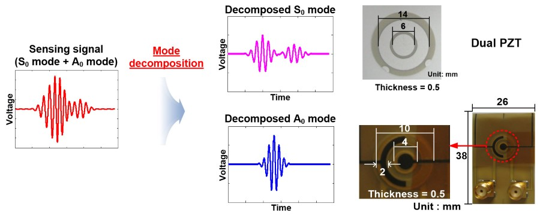

## Description
Lamb waves using surface-bonded piezoelectric transducers (PZTs) have been widely used for nondestructive testing (NDT). However, the identification of individual Lamb wave modes and the subsequent data interpretation are often difficult due to the dispersive and multimodal natures of Lamb waves. To tackle the problem, a Lamb wave mode decomposition technique using concentric ring and circular PZTs is proposed. **Its advantages over the conventional approaches are that (1) PZTs need to be placed only a single surface of a specimen and (2) mode decomposition can be performed at any desired frequency without changing the PZT size and/or spacing configuration.** The proposed mode decomposition technique is formulated by solving 3D Lamb wave propagation equations considering the PZT size and shape, and this technique requires a specially designed dual PZT composed of concentric ring and circular PZTs. The effectiveness of the proposed technique for the Lamb wave mode decomposition is investigated through numerical simulation and experimental tests performed on an aluminum plate. 

## Publication

* **Chul Min Yeum**, Hoon Sohn, and Jeong Beom Ihn. “Lamb Wave Mode Decomposition Using Concentric Ring and Circular Piezoelectric Transducers.” Wave Motion 48, no. 4 (June 2011): 358–70. [**[Web]**](http://www.sciencedirect.com/science/article/pii/S0165212511000102).

* **Chul Min Yeum**, Hoon Sohn, Jeon Beom Ihn, “Lamb Wave Decomposition using Amplitude Matching with Concentric Circular PZT Transducers,” the 5th European Workshop on Structural Health Monitoring, Sorrento, Italy, June 29-July 02, 2010. [**[Web]**](https://goo.gl/MeI0S6),[**[PPT]**](http://chulminy.github.io/cv/Files/Conference/2010_EWSHM_PPT.pdf).    

## Collaborators

* Hoon Sohn
* Jeon Beom Ihn

## Acknowledgment
This work is supported by the Boeing Company, the Radiation Technology Program (M20703000015-07N0300-01510) and the Nuclear Research & Development Program (2009-0083489) of National Research Foundation of Korea (NRF) funded by Ministry of Education, Science & Technology (MEST). The authors also would like to thank Dr. Sang Jun Lee for providing invaluable comments for this study.

## Source Code & Data
* All source code and data are released in this repository. 
* If you use the code and data for you publication, **please cite my paper(s)**.

## Setup
* `Run_FEMValid.m` is to theoretically validate the proposed technique using numerical simulation. Please refer to **Section 3** in the [**journal paper**](http://chulminy.github.io/cv/Files/Journal/2011_Wavemotion_Lamb_Wave_Mode.pdf).

* `Run_EXPValid.m` is to examine the feasibility of the proposed technique using real experiment. Please refer to **Section 4** in the [**journal paper**](http://chulminy.github.io/cv/Files/Journal/2011_Wavemotion_Lamb_Wave_Mode.pdf).

## Sample Results (Numerical Simulation)

### Configuration of the numerical simulation
> ** The goal is to decompose the S0 and A0 modes in the signal obtained from Path AB. Herein, the normalized scaling factors are obtained from theoretical solutions. PZT C is only used for the validation of the proposed method and not needed for its actual implementation.**  

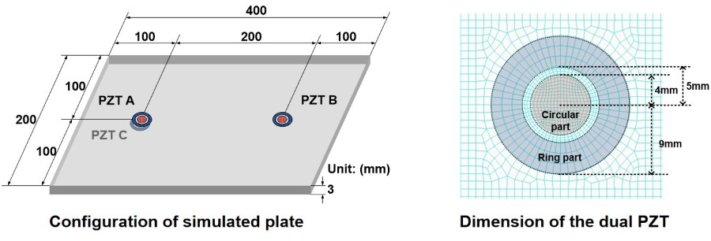

### Comparison of the normalized scaling factor obtained from FEM simulation and theoretical formulation

> **The normalized scaling factors computed from theoretical solutions in Section 2 perfectly follow the ones obtained from FEM simulation**  

Scaling factors for the S0 mode |  Scaling factors for the A0 mode  
:------------------------------:|:-------------------------:
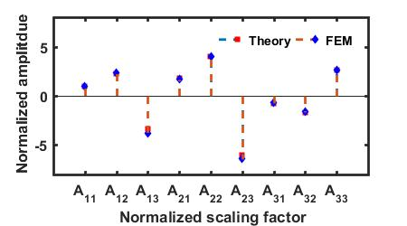     |  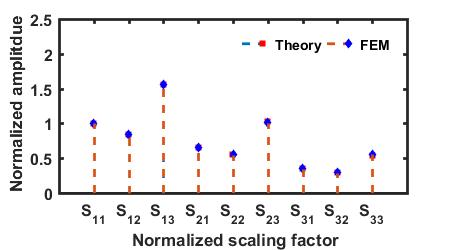

### Comparison between the S0 and A0 modes decomposed by the proposed method and the ones selectively generated by the collocated PZTs A and C
> ** The proposed technique successfully decomposes the S0 and A0 modes in the signal from dual PZTs. The proposed method can also extract the reflections of the S0 and A0 modes.**

S0 Mode in V13 				    |  A0 Mode in V13  
:------------------------------:|:-------------------------:
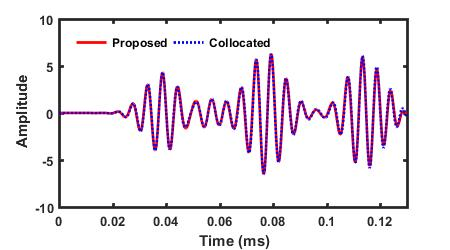     	|  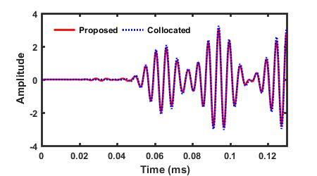

S0 Mode in V32 				    |  A0 Mode in V32  
:------------------------------:|:-------------------------:
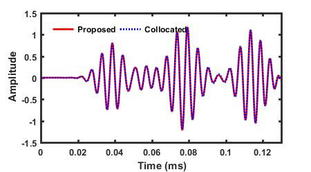     	|  

## Sample Results (Experiment)

### Configuration of the experiment
> ** The goal is to decompose the S0 and A0 modes in the signal obtained from Path AB. The normalized scaling factors are obtained from path AD because the S0 and A0 modes in path AD have enough separation to compute them. PZT C is only used for the validation of the proposed method and not needed for its actual implementation.**  

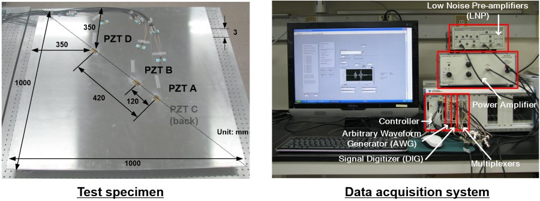

### Comparison of the normalized scaling factor obtained from paths AB and AD

> **The normalized scaling factors in the path AD are in good agreement with those in the path AB. In theory, the normalized scaling factors must be identical regardless of length of paths as long as the sizes of the dual PZTs are identical and the plate is homogeneous. Thus, the S0 and A0 modes in the path AB can be decomposed using the normalized scaling factors obtained from the path AD.**  

Scaling factors for the S0 mode |  Scaling factors for the A0 mode  
:------------------------------:|:-------------------------:
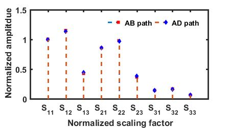     |  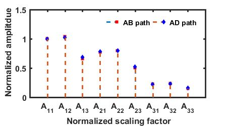

### Comparison between the S0 and A0 modes in the path AB decomposed by the proposed technique (the dashed line) and the ones selectively generated by the collocated PZTs A and C

> ** The result shows that the decomposed S0 and A0 modes are in a good agreement with the selectively generated S0 and A0 modes signals. Even the first and/or second reflections of the S0 and A0 modes can be effectively extracted from the measured signals.** 

S0 Mode in V13 				    |  A0 Mode in V13  
:------------------------------:|:-------------------------:
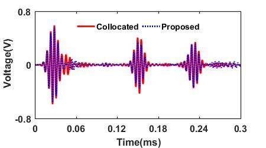     |  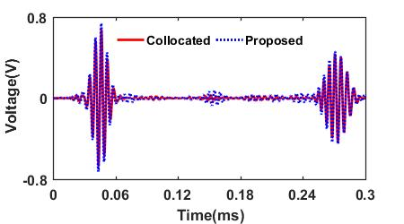

S0 Mode in V32 				    |  A0 Mode in V32  
:------------------------------:|:-------------------------:
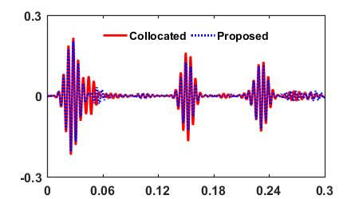     |  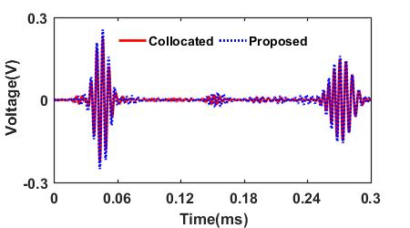
